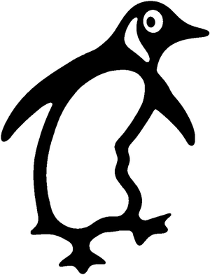

# Image-Processing
Some Image Processing Ideas Implementation.

This Code Extracts the Connected Components in an image.

## Steps:

  1- Convert Image to gray-scale.
  
  2- Apply a Median Filter to remove the noise.
  
  3- Apply a threshold i.e. make it a binary image.
  
  4- Apply an Opening Process (Erosion then Dilation).
  
  5- Label each Connected Component (i.e. color them with a random color) using Flood-Fill Algorithm.
  
  
## Screeshots:

  This GIF shows the above steps when applied on the Penguin Image.
  
  
  
## Usage:

  1- Put a bitmap -imageName.bmp- image in the "input" folder.
  
  2- Run myprogram.out in terminal using: `./myprogram.out imageName.bmp`
  
## License

[MIT](https://choosealicense.com/licenses/mit/)
 
